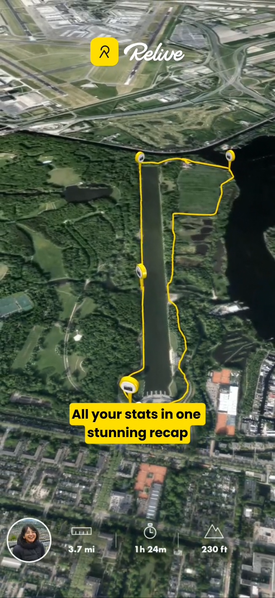

# Flyover Route Visualiser

A single-file, Relive-style **cinematic flyover** for GPX routes, built with
[Mapbox GL JS v3](https://docs.mapbox.com/mapbox-gl-js/) using the Mapbox
**Standard** / **Standard Satellite** styles and a free-camera path animation.

Pick a route from the dropdown and the camera flies along the track over 3D
terrain, drawing the trail as it goes — with a live stats bar (distance /
duration / elevation gain), an elevation profile, and a full panel of style and
camera controls.



---

## What it does

- **Cinematic flyover** — a chase camera follows the route point-by-point
  (`FreeCameraOptions` + `MercatorCoordinate`, per the
  [free camera path example](https://docs.mapbox.com/mapbox-gl-js/example/free-camera-path/)).
  It samples terrain height (`queryTerrainElevation`) each frame so it clears
  mountains instead of clipping through them.
- **Progressive trail** — the yellow route line draws in as the camera advances
  (`line-trim-offset`), over a faint full-route "ghost" preview, with start /
  finish pins and a pulsing head marker.
- **9 bundled routes** — a deliberate mix of terrain: Paris city rides/runs, a
  Rome stroll, Fontainebleau forest, a Dutch waterway, and alpine hikes
  (Mt Rainier ×2, Acadia, Melbourne's 1000 Steps).
- **Smart per-route styling** — mountain / outdoor / water routes default to
  **Standard Satellite** (satellite imagery + 3D terrain); city routes default
  to **vector Standard**. You can override the style for any route.
- **Live stats** — distance, duration, and elevation gain, with a **km ↔ mi**
  toggle, plus an interactive **elevation profile** that tracks flyover progress.
- **Playback** — play / pause / restart / scrub / loop.

---

## Quick start

### 1. Add your Mapbox token

The token lives in a local **`config.js`** that is **git-ignored** (see
`.gitignore`), so it never gets committed. Copy the template and paste your
**public** token (`pk.…`):

```bash
cp config.example.js config.js
# then edit config.js:
#   window.MAPBOX_TOKEN = 'pk.your_real_token';
```

Get a token from your [Mapbox account](https://account.mapbox.com/access-tokens/).
(Alternatively, pass one at runtime with `?access_token=pk.…` in the URL, or set
`localStorage.mapbox_token` — both override `config.js`.)

### 2. Run it

The bundled route dropdown loads GPX files with `fetch('./gpx/…')`, which needs
the page served over **http** (not opened directly as a `file://` path). From
this folder:

```bash
python3 -m http.server 8000
```

Then open **http://localhost:8000**.

> **No server?** Just double-click `index.html` and use the **"upload a .gpx
> file"** link (or drag-and-drop a `.gpx` onto the page). That path works from
> `file://` — only the pre-bundled dropdown needs the server.

---

## Using the app

| Control | What it does |
|---|---|
| **Route** | Pick one of the bundled GPX routes (or upload your own `.gpx`). |
| **Base map style** | Standard Satellite (satellite + terrain), vector Standard (3D), or classic Satellite Streets. Auto-defaults per route type; override any time. |
| **Light / time of day** | Dawn / day / dusk / night (Standard `lightPreset`). |
| **Route colour + width** | Trail colour (with quick swatches, incl. Relive yellow) and thickness. |
| **Terrain exaggeration** | Vertical relief multiplier. Auto-seeded higher for mountainous routes. |
| **Camera height / follow distance** | How high above ground and how far behind the moving point the camera sits (together these set the effective tilt). |
| **Flyover speed** | Playback speed multiplier (route length also scales the duration). |
| **Place labels / 3D objects** | Toggle Standard place labels and 3D buildings/trees. |
| **Loop** | Restart the flyover automatically when it finishes. |
| **Units** | Switch stats between km and mi. |
| **Transport bar** | Scrub, restart, and play/pause; the elevation profile cursor follows along. |

---

## How it works (architecture)

Everything lives in **`index.html`** — no build step. Mapbox GL JS and
[Turf.js](https://turfjs.org/) are loaded from CDNs.

1. **GPX parsing** (`parseGpx`) — `DOMParser` extracts `<trkpt>` coordinates,
   `<ele>` (metres) and `<time>` (ISO-8601) into arrays.
2. **Route model** (`buildRoute`) — builds a Turf `LineString`, computes length
   (`turf.length`), bounding box (`turf.bbox`), duration, min/max elevation, and
   **elevation gain**. Gain is computed from a **window-21 moving-average** of
   the elevation series, so raw GPS jitter on flat/marine tracks isn't
   accumulated as thousands of phantom metres while real climbs are preserved.
3. **Map + terrain** — Mapbox `standard` / `standard-satellite` styles on a
   globe projection; a `mapbox-dem` raster-DEM source drives `setTerrain` with
   the exaggeration slider. Standard config (`lightPreset`, label & 3D toggles)
   is applied via `setConfigProperty('basemap', …)`.
4. **Route layers** — a GeoJSON source (`lineMetrics: true`) with three line
   layers: faint full-route ghost, dark casing, and the bright trail. The trail
   and casing use `line-trim-offset` to reveal only the travelled portion.
5. **Flyover** (`renderAt(phase)` + a `requestAnimationFrame` loop) — for each
   progress `phase ∈ [0,1]` it places the target and camera points along the
   route (`turf.along`), positions the free camera above the terrain, aims it at
   the target, and updates the trail trim, head marker, and elevation cursor.
6. **UI** — the config panel and HUD are plain DOM; changes update `state.cfg`
   and re-apply live.

### Adding / changing routes

Drop new `.gpx` files into `gpx/` and add an entry to the `ROUTES` array in
`index.html`:

```js
{ file:'my_route.gpx', title:'My Route', type:'mountain' },
```

`type` (`mountain` | `outdoor` | `city` | `water`) chooses the default base
style and seeds the terrain exaggeration. Any `.gpx` can also be loaded
ad-hoc via the upload / drag-and-drop fallback without editing the manifest.

---

## Requirements & notes

- A **public** Mapbox access token (`pk.…`). Keep secret tokens out of
  client-side code.
- A modern browser (Chrome / Safari / Firefox / Edge) with WebGL.
- Network access for the Mapbox tiles/styles and the two CDN scripts
  (`mapbox-gl` and `@turf/turf`).
- Bundled GPX routes live in `gpx/`. Reference video frames
  (`videoframe_*.png`) show the target Relive look.
